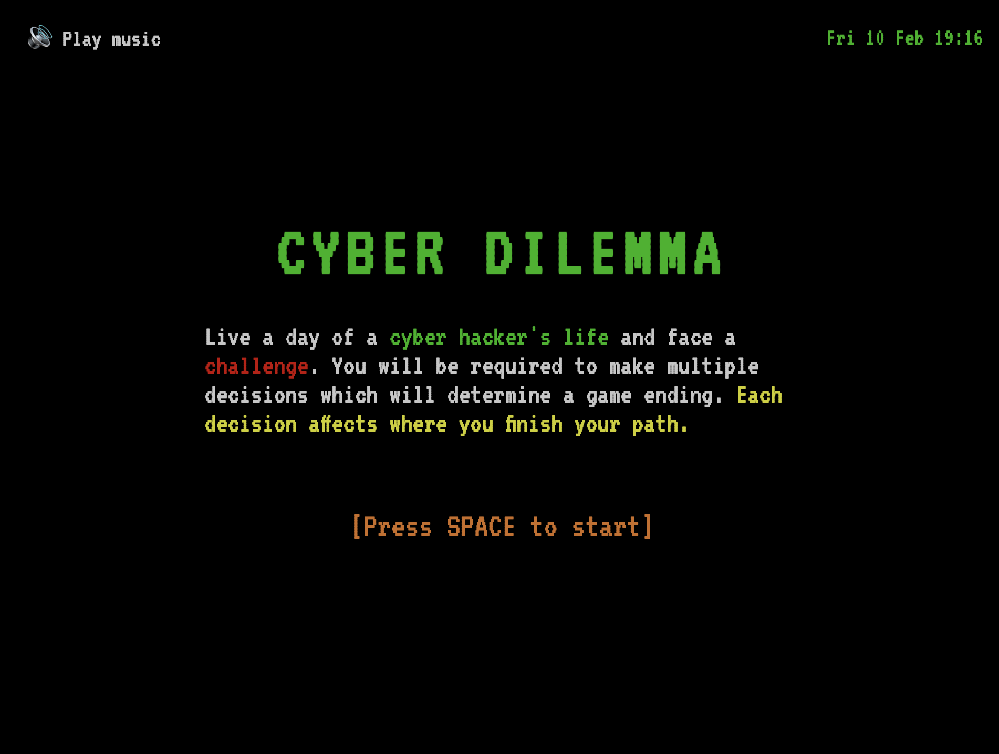
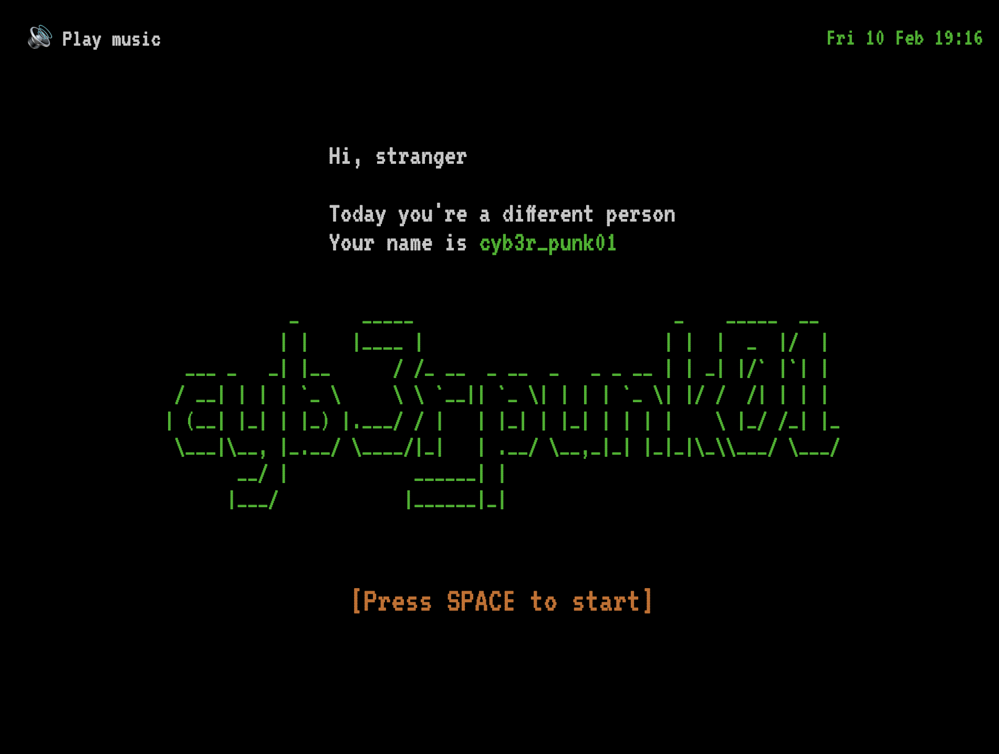
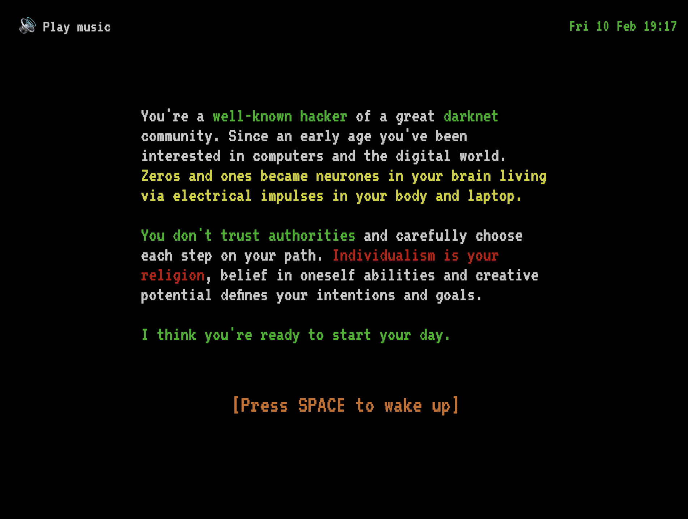

# ✋🚧 WORK IN PROGRESS

# Cyber dilemma

Is a web game about social dilemmas, choices and living a day of a hacker's life. Three main ideas which I want to convey:

1. Every choice and action matters
2. World is mostly grey, not black and white. You form your values and decide what is good and evil
3. You will always face a social dilemma, choice between your personal and group’s well being

